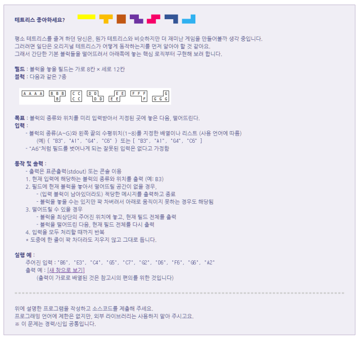
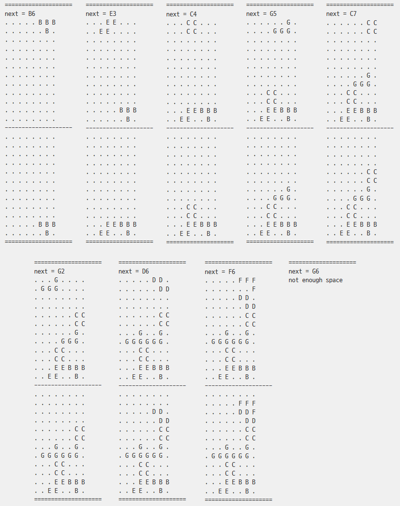

## 1. Instruction
- reference: [__Synap soft(R)__ : 2018. 11](http://www.synapsoft.co.kr/jsp/recruit/1811.html) - recruiting quiz!
- rules / inputs & outputs


  


 <br><br>
## 2. Run
 - __screen input/output__
   

<br><br>
## 3. Algorothm
- rules : blocks are consists with '1' or '0'
- calculate forward and check bits over '1'
- if collided, there's bit over '1'
  1. one step backward and fix [__field__]
  1. fix filed
- if not, 1step forward and check, repeatedly


<br><br>
## 4. Coding
- __functions__
  1. check block forward

 ```python
 def chk_no_block_forward(field, start):
     # if '1' in _strings return 'Fasle'
     # '1' Not exist,  True -- 'no block'
     _string = ""
     for n in range(10):
         _string += field[n+2]
     return _string.find("1") == -1:
 ```

